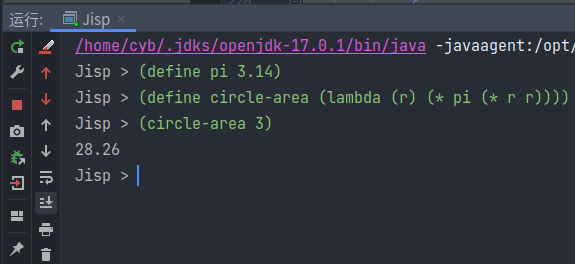

# Jisp

Java 实现的 Lisp 解释器

* extend 包下是紧密的类结构实现，借助密封类的继承
* methodHandle 包借助了方法句柄，是更精简的实现，思路来自 [Remi Forax](https://forax.github.io/2014-06-01-e733e6af6114eff55149-lispy_in_java.html)

[参考博客](http://norvig.com/lispy.html)

## 支持特性
* define 定义宏
* \+ - \* \ 等基本运算 支持连加连乘
* = > < 等基本比较
* if 判断语法
* car cdr list
* Lambda 表达式

## 示例
